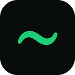
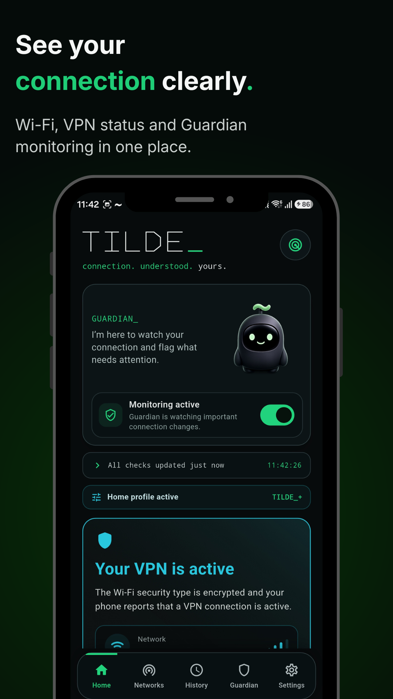
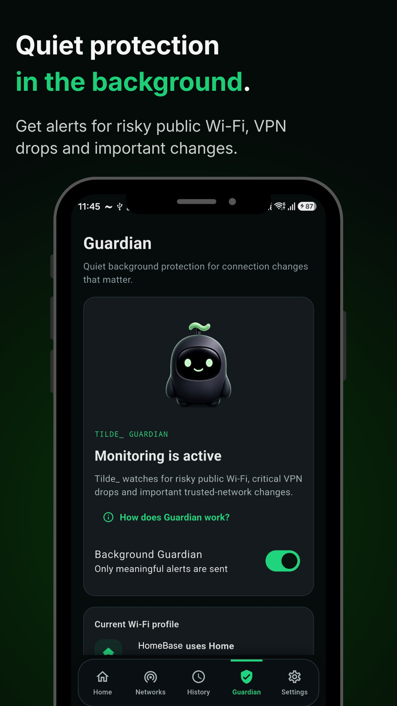
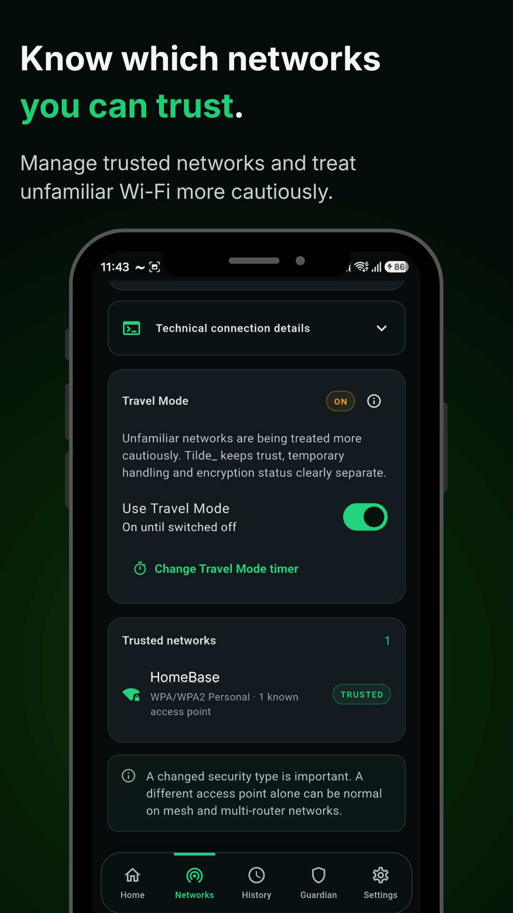
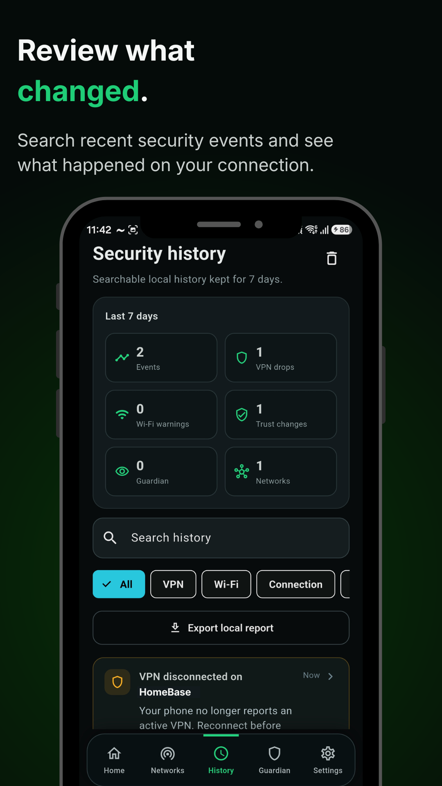
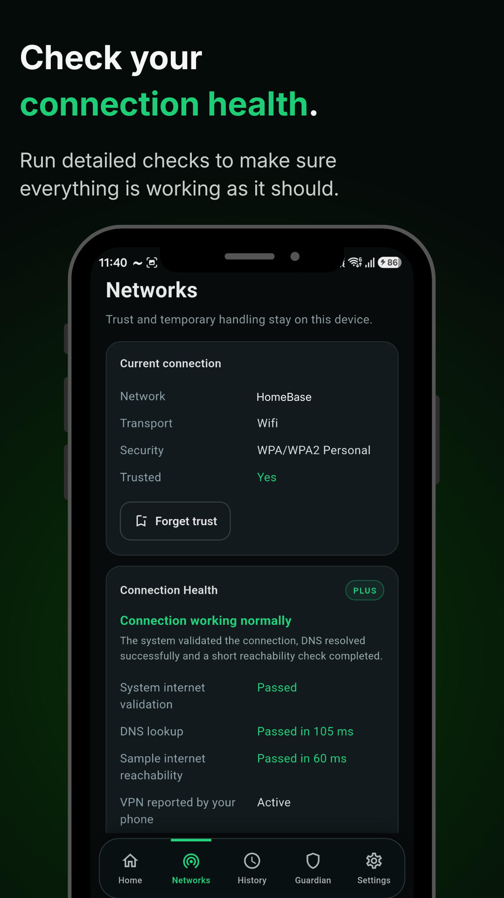
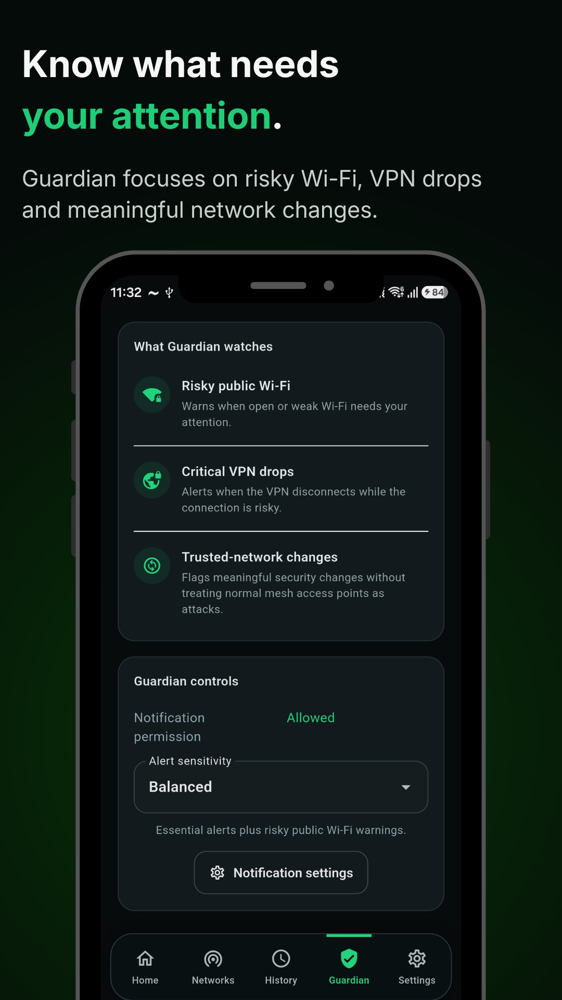

  
  <h1>TILDE_</h1>
  
<strong>Wi-Fi Companion · Android app · Published on Google Play</strong>

  
<em>Quietly watching your connection.</em>

  
A security-awareness companion that turns Android Wi-Fi and VPN signals into understandable guidance.

  
<strong><a href="https://play.google.com/store/apps/details?id=com.tildecompanion.app">View on Google Play</a></strong> · <strong><a href="https://tomcouchman.github.io/tilde.html">Portfolio case study</a></strong> · <a href="https://moondocks.github.io/">Moon Docks</a>

---

## The idea

Unfamiliar Wi-Fi can be confusing: a connection may look normal without giving someone enough context to make a sensible decision. TILDE_ was my attempt to make available connection information **clear, calm and actionable**—without pretending that an app can guarantee a network is safe.

## Inside the app

Six original **1080 × 1920** screenshots. Click any image to view the full-size PNG.

<table>
  <tbody>
  <tr>
    <td align="center" width="33%"> <strong>Connection overview</strong></td>
    <td align="center" width="33%"> <strong>Guardian monitoring</strong></td>
    <td align="center" width="33%"> <strong>Trusted networks</strong></td>
  </tr>
  <tr>
    <td align="center" width="33%"> <strong>Security history</strong></td>
    <td align="center" width="33%"> <strong>Connection Health</strong></td>
    <td align="center" width="33%"> <strong>Guardian details</strong></td>
  </tr>
  </tbody>
</table>

### What it offers

- **Connection awareness** — readable Wi-Fi security information and Android-reported VPN status.
- **Guardian** — alerts for meaningful network changes when monitoring is enabled.
- **Trusted networks & Travel Mode** — distinguish familiar Wi-Fi from networks that deserve more caution.
- **Connection Health** — explain connectivity checks and important connection signals.
- **Local history** — review and search recent network events and alerts.
- **TILDE_+** — optional additional features for users who want more detail.

## My contribution — and the role of AI

**I conceived and directed TILDE_**, defining the purpose and feature priorities, shaping how security information should be explained, reviewing the interface, testing Android builds, identifying issues, guiding iterations and taking the product through Google Play publication.

**AI-assisted implementation:** AI coding tools produced and revised much of the app's Flutter/Dart and Kotlin code. I do **not** present those languages as personal programming skills or claim that I wrote the implementation myself. My contribution was focused on **product direction, security reasoning, testing, iteration and release**.

*Technology used in the application: Android · Flutter/Dart · Kotlin.*

## Security thinking and limitations

| Principle | Decision |
| --- | --- |
| **Awareness, not certainty** | Security signals need explanation; they cannot prove that a Wi-Fi network is safe. |
| **Trust isn't verification** | A trusted-network label means the user recognises the network, not that it has been certified secure. |
| **Be precise about VPNs** | The app reports VPN status available from Android; it does not provide a VPN service. |
| **Privacy-conscious by design** | Trusted networks and security history are designed to stay on the device. |
| **Respect platform limitations** | Information and alerts depend on Android APIs, permissions and the signals the device exposes. |

TILDE_ is **not antivirus software, a firewall or a VPN**, and it cannot guarantee protection on public Wi-Fi. Its job is to help users understand the connection information available to them.

## Why it belongs in my cybersecurity portfolio

TILDE_ complements my **[HomeSOC Log Analyzer](https://github.com/tomcouchman/homesoc-log-analyzer)** project. HomeSOC demonstrates practical Python-based log analysis; TILDE_ demonstrates applying security concepts to a real-world user problem, recognising technical limits and communicating them responsibly.

It also gave me hands-on experience of product testing, documenting issues, refining software behaviour and bringing an app to a public release.

---

**[Google Play](https://play.google.com/store/apps/details?id=com.tildecompanion.app)** · **[Personal portfolio](https://tomcouchman.github.io/tilde.html)** · **[Moon Docks](https://moondocks.github.io/)**

Public project showcase only. This repository does not contain the application's source code, signing materials, private configuration or internal build files.
